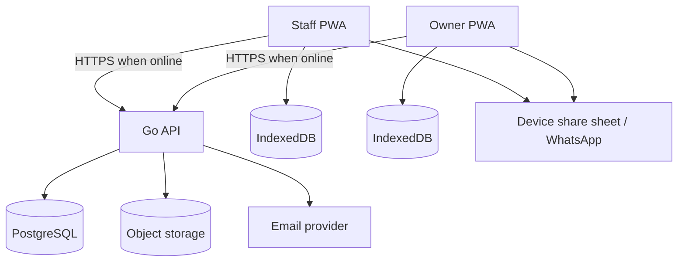
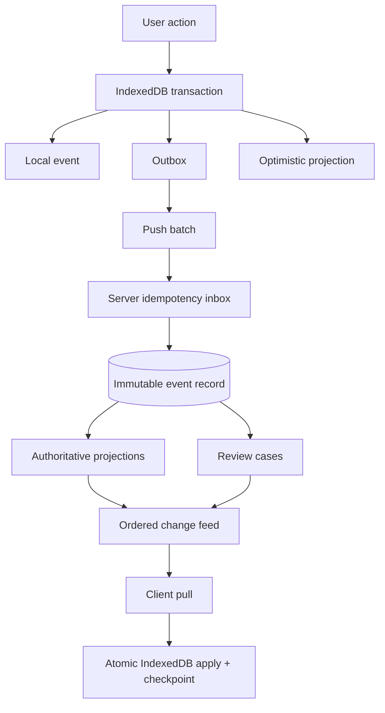
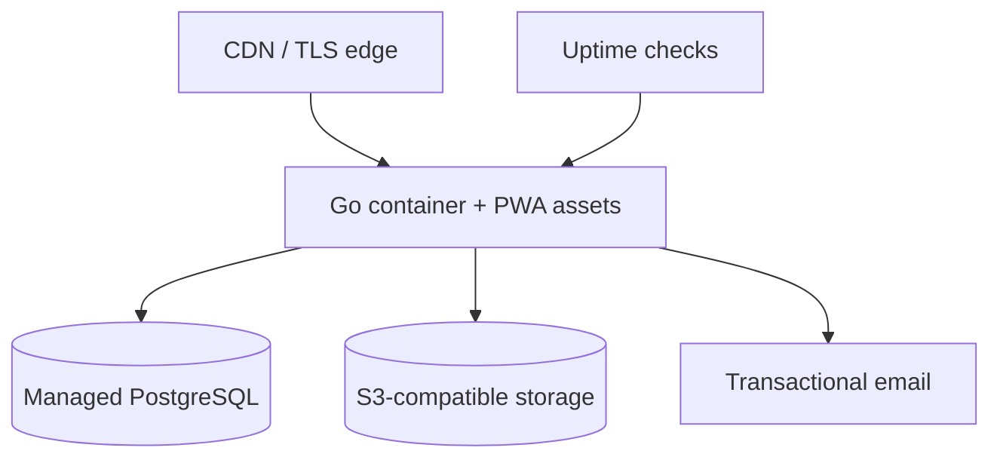

# justbarme MVP Technical Architecture

**Status:** Proposed architecture decision record  
**Date:** 2026-09-12  
**Scope:** MVP through The Place pilot  
**Product source of truth:** Product Context, MVP Requirements & Architecture Handoff

---

## 1. Executive decision summary

Build justbarme as an **offline-first PWA backed by a Go modular monolith and PostgreSQL**.

### Selected architecture

| Area | Decision |
|---|---|
| System shape | Modular monolith, not microservices |
| Frontend | React + TypeScript + Vite PWA |
| Local database | IndexedDB, accessed through Dexie |
| Service worker | Workbox-generated application-shell service worker |
| Backend | Go HTTP server using `net/http` and the lightweight Chi router |
| Database access | `sqlc` over explicit SQL for static queries; direct `pgx` for genuinely dynamic queries |
| Primary database | PostgreSQL |
| Multi-tenancy | Shared database/shared schema with `business_id` on tenant-owned rows |
| Tenant enforcement | PostgreSQL RLS, tenant-aware foreign keys, and application authorization |
| Domain history | Immutable operational records plus conventional state projections |
| Sync | Client outbox push + server change-feed pull |
| IDs | UUIDv7 using `github.com/google/uuid`; clients generate offline entity/event IDs |
| Money | Integer minor units (`bigint` kobo), never floating point |
| Quantities | `numeric(18,3)` in PostgreSQL; decimal strings over JSON |
| Inventory | Append-only quantity ledger plus costed receipt lots |
| Costing | FIFO-ready data model; authoritative COGS/profit deferred until inventory is reconciled |
| Corrections | Reversal/correction records, never silent history rewrites |
| Authentication | Online password/session authentication plus bounded signed offline authorization lease |
| Deployment | One Go container, static PWA assets, managed PostgreSQL, S3-compatible object storage |
| Region | One European region with measured Nigerian latency; no multi-region MVP |

### Why this shape

It addresses the hard requirements without introducing infrastructure the MVP does not need:

- PostgreSQL provides relational integrity, transactions, reporting, RLS, and mature backups.
- A modular monolith keeps deployment and transaction boundaries simple.
- IndexedDB preserves transactions locally when connectivity fails.
- Immutable operational events make retries, corrections, activity history, and conflict review auditable.
- Materialized state tables keep normal application queries straightforward; this is not full event sourcing.
- Shared-schema tenancy is affordable for many small businesses and can later be split by tenant if actual scale demands it.

---

## 2. Architectural principles

1. **A completed local action is durable before the UI says it is saved.**
2. **A retry must not create a duplicate sale, payment, stock receipt, or expense.**
3. **A synchronization conflict must never silently delete a legitimate business event.**
4. **Posted financial and inventory history is immutable.** Corrections are new records.
5. **The server is authoritative for consolidated state; an offline device shows provisional state.**
6. **Every tenant-owned relationship is tenant-safe in both database constraints and application code.**
7. **Money uses integer kobo and quantities use exact decimals.**
8. **Current totals are projections; operational records are the history from which they can be checked or rebuilt.**
9. **MVP infrastructure remains boring:** one application, one database, no queue cluster, no Kubernetes.
10. **The pilot may change workflows, but should not require replacing the architectural foundations.**

---

## 3. System context



The PWA remains usable from its local database and cached application shell. It does not depend on a live API response to record common operations.

---

## 4. Backend architecture

### 4.1 Modular monolith

Use one deployable Go service with internal modules. Modules communicate through Go interfaces and service calls, not HTTP calls or a message broker.

Selected package structure:

```text
cmd/
  api/
    main.go                 thin executable entry point
internal/
  app/
    app.go                  composition root and dependencies
    run.go                  startup and graceful shutdown
  config/
    config.go
  httpapi/
    server.go               http.Server construction
    router.go               Chi routes and middleware order
    middleware.go           HTTP-only middleware
    json.go                 transport encoding/decoding
    errors.go               API error mapping
    health.go               health handlers
    # later: one transport file per feature
  store/
    postgres.go             pgxpool lifecycle
    tx.go                   transaction and tenant-scope helpers
    queries/                sqlc input SQL
    sqlc/                   generated database package
  auth/                     password, online session, offline lease primitives
  tenancy/                  principal/business context and authorization
  identity/                 users, memberships, invitations, devices
  business/                 business settings and branding
  catalogue/
  syncer/                   sync protocol; avoids collision with stdlib sync
  sale/
  bill/
  payment/
  inventory/
  expense/
  activity/
  report/
  review/
  sharing/
migrations/
web/                        frontend project
```

There is no official universal Go project layout. This structure follows idiomatic boundaries: `cmd/api/main.go` only starts the program; `internal/app` wires dependencies; `internal/httpapi` owns transport concerns; `internal/store` owns PostgreSQL/`sqlc` infrastructure; feature packages own business use cases. Avoid a generic `platform` directory because it tends to become a dumping ground.

Use module path `github.com/mananuf/justbarme` with Go 1.22 as the minimum language/toolchain version. Do not create empty packages in advance; the full tree above is the destination, not Phase 1 scaffolding.

Each feature package should usually contain only what it needs:

```text
model.go       domain types and invariants
service.go     use cases and transaction orchestration
repository.go  narrow persistence interface when it improves testing/design
postgres.go    adapter over store/sqlc or pgx where feature-specific
errors.go      typed domain errors
```

HTTP handlers remain in `internal/httpapi` so business packages do not depend on HTTP. Do not create repository interfaces mechanically for every table, and do not force every table behind one generic repository. Explicit use-case-oriented SQL is easier to audit for tenancy and transaction correctness.

### 4.2 HTTP layer

Use `net/http` with **Chi** (`github.com/go-chi/chi/v5`) for routing. Chi is a small, idiomatic router built around `http.Handler`; it is a library, not a web framework. It provides route groups, URL parameters, nested resources, and middleware composition without imposing an application architecture.

```text
GET  /api/v1/...
POST /api/v1/...
```

Middleware should be small explicit wrappers for:

- request ID
- panic recovery
- structured access logging
- security headers
- authentication
- business context
- authorization
- request size limits
- timeouts
- CORS only if API and PWA are on different origins

Prefer serving the PWA and API from the same origin. This simplifies cookies, CORS, deployment, and browser security.

### 4.3 Necessary libraries

“No framework” should not mean reimplementing security or database protocols.

Recommended dependencies:

- `github.com/go-chi/chi/v5` — lightweight `net/http` router and middleware composition
- `github.com/jackc/pgx/v5` — PostgreSQL driver and pooling
- `github.com/sqlc-dev/sqlc` — standard build-time typed SQL generation for static queries
- `github.com/google/uuid` — UUIDv7 generation through `uuid.NewV7`
- `github.com/golang-migrate/migrate/v4` — schema migrations
- `golang.org/x/crypto/argon2` — password hashing
- a small standards-compliant validation helper only if handwritten validation becomes repetitive

Use `log/slog`, `net/http`, `encoding/json`, `context`, and `crypto/*` from the standard library.

### 4.4 Errors

Return a stable JSON error envelope:

```json
{
  "error": {
    "code": "BILL_ALREADY_CLOSED",
    "message": "This bill can no longer accept items.",
    "request_id": "...",
    "details": {}
  }
}
```

Clients branch on `code`, not English text. Do not expose SQL details or stack traces.

### 4.5 Transactions

The service layer owns transaction boundaries. A posted business action, its ledger effects, activity row, review case, and change-feed entries commit together.

High-value operations should run at `READ COMMITTED` with explicit row locks and deterministic lock ordering. Use `SERIALIZABLE` only for a use case proven to need it, with bounded retry handling.

---

## 5. Frontend and PWA architecture

### 5.1 Framework decision

Use **React + TypeScript + Vite**.

React is justified by the number of interactive workflows, responsive layouts, local projections, and sync states. A server-rendered application would not remove the need for substantial offline client logic.

Keep the dependency set restrained:

- React and React Router
- Dexie for IndexedDB
- Zod or Valibot for runtime parsing at storage/API boundaries
- a minimal state store such as Zustand only for ephemeral UI state
- Workbox through a Vite PWA integration

Do not make TanStack Query or an in-memory store the source of truth for offline business data. IndexedDB is the operational local source.

### 5.2 Frontend structure

```text
web/src/
  app/                 routing, shell, providers
  db/                  IndexedDB schema and migrations
  sync/                outbox, push, pull, reconciliation
  auth/                online session and local unlock
  features/
    dashboard/
    sell/
    bills/
    stock/
    expenses/
    activity/
    reports/
    settings/
  components/          shared visual components
  domain/              money, quantity, IDs, common types
  api/                 HTTP client and schemas
  sw/                  service-worker integration
```

Organize by product feature rather than by generic component type.

### 5.3 IndexedDB stores

| Store | Purpose |
|---|---|
| `local_events` | Immutable locally created operations |
| `outbox` | Pending push entries and retry metadata |
| `event_outcomes` | Server outcome for each local event |
| `entities` | Replicated authoritative entities/projections |
| `local_projections` | Optimistic sale, bill, stock, and total views |
| `reference_data` | Products, prices, categories, members, settings |
| `review_cases` | Conflicts requiring attention |
| `sync_meta` | Device sequence, checkpoint, bootstrap state, sync lease |
| `auth_meta` | Cached identity and signed offline lease |

A local sale is one IndexedDB transaction:

1. Allocate the next device sequence.
2. Insert the immutable event.
3. Insert an outbox row.
4. Update the optimistic local projection.
5. Commit.
6. Only then display **Saved on this device**.

Request persistent browser storage with `navigator.storage.persist()`. If it is denied, show a non-blocking but visible warning. A PWA cannot guarantee survival if the user clears browser storage before synchronization; that limitation must be communicated honestly.

### 5.4 Service worker

The service worker owns:

- versioned application-shell caching
- static assets
- offline startup
- safe application upgrades
- best-effort background sync where supported

It does not exclusively own business synchronization. The shared sync engine must also run:

- at application startup
- when the application becomes visible
- after the browser reports connectivity
- on an explicit **Sync now** action
- periodically while the app is active

Do not cache authenticated API responses in the service-worker HTTP cache. Persist controlled API data in IndexedDB.

### 5.5 UX performance

- Optimize first for low-end Android phones and touch targets.
- Keep the sell screen’s initial bundle and data query small.
- Render product images only if measured useful; names and color/category cues are more reliable offline.
- Do not block selling on dashboard/report synchronization.
- Incrementally update local projections rather than recalculating all history after every pull.
- Offer favorites/recently sold ordering without hiding the full catalogue.

---

## 6. PostgreSQL choice

PostgreSQL is the recommended database because the domain requires:

- atomic multi-table transactions
- foreign keys and check constraints
- exact numeric handling
- strong reporting queries
- row-level security
- mature backup/restore tooling
- JSONB for event envelopes without sacrificing typed operational tables

SQLite is appropriate in a native local application, but browser PWAs use IndexedDB and still need a shared server database. Document databases make cross-entity integrity and financial reporting harder. MySQL could work but offers no material advantage here and has a weaker fit for the selected RLS strategy.

---

## 7. Multi-tenancy

### 7.1 Strategy comparison

| Model | Security | Cost | Operational complexity | Fit for many small bars |
|---|---:|---:|---:|---:|
| Shared tables + tenant ID | Good with layered enforcement | Lowest | Lowest | Best |
| Schema per tenant | Good namespace isolation | Medium | Migration/schema fan-out | Weak |
| Database per tenant | Strongest physical isolation | Highest | Pooling, migrations, backups per tenant | Poor |
| Hybrid | Flexible at scale | Variable | Highest initially | Future option |

### 7.2 Decision

Use **one shared PostgreSQL database and shared schema**, with `business_id` on every tenant-owned row.

Use globally unique UUIDs so a large business can later be moved to a dedicated database without changing identifiers. Do not partition tables initially.

### 7.3 Defense in depth

Tenant isolation must not depend on one `WHERE business_id = ?` convention.

1. Every tenant-owned table contains `business_id NOT NULL`.
2. Every tenant-owned table has `UNIQUE (business_id, id)`.
3. Child rows reference `(business_id, parent_id)` through composite foreign keys.
4. PostgreSQL RLS is enabled and forced on tenant-owned tables.
5. The application role is `NOBYPASSRLS` and does not own tables.
6. Each request starts a transaction and executes transaction-local tenant context:

```sql
select set_config('app.business_id', $1, true);
```

7. Owner/Staff permissions are enforced in Go after membership is loaded.
8. Cross-tenant tests are mandatory for reads, writes, and foreign-key references.

Global identity tables such as `users` are not tenant-owned. Membership joins users to businesses.

---

## 8. Domain model

### 8.1 Identity and business

#### `users`

Global human identity:

- `id`
- normalized email and/or E.164 phone
- display name
- password hash or external identity reference
- status and timestamps

#### `businesses`

- `id`
- name, timezone, currency
- phone, address, contact data
- receipt wording, footer, payment instructions
- logo object key
- status and timestamps

Defaults: `NGN`, `Africa/Lagos`.

#### `business_memberships`

- `(business_id, user_id)` primary key
- role: `owner` or `staff`
- status
- invitation and membership timestamps

#### `locations`

Create one default location per business even though multi-branch is not an MVP feature. This avoids attaching inventory directly to the business and supports a later branch migration without redesign.

The MVP UI does not expose branch management.

#### `devices`

- business and user
- device public key
- display name
- enrollment, last-sync, and revocation timestamps
- status

One device is assigned to one business/location context in the MVP.

### 8.2 Catalogue

#### `catalogue_templates`

Platform-owned common Nigerian products and suggested variants. These are onboarding templates, not live business products.

#### `categories`

Business-owned, editable, sortable, and deactivatable.

#### `products`

Conceptual product, for example `Guinness`.

#### `product_variants`

The sold and stocked unit, for example `50cl Bottle` or `33cl Can`.

All sale and stock operations reference a variant, not only a product. This keeps size, price, quantity, and purchase cost operationally distinct.

#### `product_prices`

Append-oriented effective-dated rows:

- variant
- amount in kobo
- `valid_from`
- `valid_to`
- creator

Only one current price exists for a variant. Sale items also copy the actual description and unit price charged, so historical receipts never change after a rename or price update.

### 8.3 Bills, tabs, sales, and payments

Use one unified `bill` concept:

- An immediate sale is a bill with one posted sale/round and usually one payment.
- A table tab is an open bill identified by a table label.
- A named customer tab is an open bill associated with a customer.
- More items create another immutable sale/round on the bill.
- Partial payments are separate immutable payment records.

#### `tables`

Business-configured labels such as T1–T5. No restaurant routing or kitchen behavior.

#### `customers`

Optional lightweight identity:

- name
- phone
- email
- notes

Customer identity is optional for an immediate walk-in sale or an open table. A customer name is mandatory whenever credit/outstanding debt is recorded. Phone and email remain optional but should be encouraged for sending reminders. Staff are allowed to grant credit; the action records the staff member and remains visible to owners.

#### `bills`

Recommended statuses:

- `open` — may receive sale rounds
- `closed_unpaid` — no more items; balance remains
- `settled` — payment balance is zero
- `void` — no effective sales remain

Closing a table means “stop adding items”; it does not falsely imply payment.

#### `sales`

Immutable posted rounds with:

- bill, location, seller
- client occurrence time and server receipt time
- total snapshots
- origin device/event
- reversal reference where applicable

#### `sale_items`

- product variant
- description snapshot
- quantity
- actual unit price in kobo
- line total
- optional price-history reference

The posting transaction verifies all totals. Never trust a client-computed total without recomputation.

#### `payments`

- bill
- amount
- method: `cash`, `transfer`, or `card`
- optional external reference
- actor and timestamps
- reversal reference where applicable

Track `cash`, `transfer`, and `card` in the MVP. This adds little UI cost and is important for reconciliation. Payment gateway processing remains out of scope.

Partial payment is simply a payment smaller than the outstanding balance. Overpayment is rejected in the MVP.

A write-off is not a payment. Use an owner-only `bill_write_off` event with a required reason.

### 8.4 Inventory

#### Core decision

Use an append-only stock quantity ledger from day one. Preserve every receipt’s exact cost in a separate lot. Do not make “current stock” or “current cost” the source of truth.

#### `stock_receipts` and `stock_receipt_lines`

A posted receipt records:

- location
- receiving actor
- receipt time
- each variant, quantity, and total purchase cost

Store exact line total in kobo, not only a rounded unit cost.

#### `stock_lots`

Each posted receipt line creates one costed lot containing:

- variant/location
- received quantity
- total received cost
- received time
- optional batch/expiry information

The lot’s original values are immutable.

#### `inventory_events`

Operational movement headers:

- receipt
- sale
- sale reversal
- adjustment
- count adjustment
- correction

They identify actor, device, reason, occurrence time, receipt time, and business reference.

#### `inventory_movements`

Append-only signed quantity movements:

- receipt: positive
- sale: negative
- reversal: opposite of original
- adjustment: signed

`inventory_balances` is a rebuildable projection keyed by business, location, and variant.

#### Counts

A physical count is an observation, not permission to silently overwrite the ledger.

`stock_counts` and `stock_count_lines` preserve:

- expected quantity at the count’s basis checkpoint
- physical quantity
- variance
- counter and times

If relevant stock changed after the device’s basis checkpoint, preserve the count and open a `STALE_STOCK_COUNT` review rather than blindly setting current stock.

Do not require an operational stock freeze in the MVP. The checkpoint-based review model handles concurrent activity honestly. The owner resolves the review with an explicit approved adjustment and reason; staff may submit an adjustment request but cannot approve/post the final adjustment.

### 8.5 Costing decision

#### Comparison

| Concern | FIFO | Moving weighted average |
|---|---|---|
| Preserves explanation by receipt lot | Excellent | Weak |
| Operational/accounting explanation | Clear | Simple aggregate |
| Posting implementation | More complex | Simpler |
| Late offline sales | Requires a deterministic posting rule | Still requires late-event policy |
| Future expiry/batch support | Natural | Separate mechanism |

#### Recommendation

Adopt **FIFO as the target valuation method**, ordered by server posting/allocation sequence, then receipt time and lot ID. Do not retroactively reorder posted COGS based on an unreliable offline device clock.

However, **authoritative COGS, gross profit, and full FIFO allocation are Phase 2**, not a blocker for the operational MVP.

The MVP must:

- preserve every receipt lot and exact cost
- preserve every signed inventory movement
- maintain expected quantity
- allow expected quantity to become negative after concurrent offline sales
- open a `NEGATIVE_INVENTORY` review case
- mark unmatched sale quantity as pending cost allocation
- omit or clearly label COGS/profit as unavailable while unresolved quantities exist

This resolves the product’s highest-priority rule: a real sale is never rejected or deleted merely because another disconnected device synchronized first.

Once inventory is reconciled, a later FIFO allocator can create immutable `sale_item_lot_allocations`. Existing receipt, sale, and movement records do not need redesign.

Do not invent zero-cost stock to make profit reports look complete.

### 8.6 Expenses

`expense_categories` are business-owned and configurable.

`expenses` contain:

- category
- description
- amount in kobo
- payment method
- actor
- occurrence and server receipt timestamps
- reversal reference where applicable

Recorded expenses are immutable. An “edit” UI creates a reversal and replacement.

### 8.7 Activity and reviews

`activity_events` is an append-only human-readable projection of business actions. It is not the only source of financial or inventory truth.

`review_cases` contains:

- type and severity
- affected entities/events
- expected and observed values
- status: `open`, `acknowledged`, `resolved`, `dismissed`
- reviewer, resolution event, reason, and timestamps

Initial review types:

- `NEGATIVE_INVENTORY`
- `STALE_STOCK_COUNT`
- `DUPLICATE_EXTERNAL_PAYMENT_REFERENCE`
- `STALE_PRODUCT_PRICE`
- `OFFLINE_PERMISSION_EXPIRED`
- `EVENT_ID_COLLISION`

Review resolution is itself auditable.

---

## 9. Immutable history versus mutable state

This system should not implement full event sourcing for every setting and screen.

Use three categories:

### Immutable operational records

- posted sales and reversals
- payments and reversals
- stock receipts and movements
- posted counts and adjustments
- expenses and reversals
- sync event envelopes and outcomes

### Conventional versioned state

- business settings and branding
- products and categories
- current price row
- member status and role
- table configuration
- customer contact information

These use versions/optimistic concurrency and activity history. They can be edited because they describe configuration, not completed financial facts.

### Rebuildable projections

- current stock
- bill outstanding balance
- daily totals
- dashboard counts
- sales summaries
- activity display rows
- review queues

Projection updates occur synchronously in the same PostgreSQL transaction for MVP simplicity.

---

## 10. Offline synchronization

### 10.1 Model

Use a **hybrid event/state replication protocol**:

- Devices push immutable locally recorded business events.
- The server validates, records, and projects them.
- Devices pull an ordered feed of authoritative projection and reference-data changes.
- Conventional configuration edits use versions and explicit conflict responses.

Do not synchronize arbitrary database row snapshots. Do not use last-write-wins for money or inventory.



### 10.2 Event envelope

Every local event includes:

- UUIDv7 `event_id`
- enrolled `device_id`
- monotonically increasing `device_seq`
- event type and schema version
- aggregate type and client-generated aggregate ID
- actor and business inferred/verified by credentials
- device occurrence time
- basis sync checkpoint
- dependencies where required
- typed payload

Do not use client timestamps to establish canonical ordering.

Server uniqueness constraints:

- `(business_id, event_id)`
- `(business_id, device_id, device_seq)`

If an ID is retried with the same canonical payload hash, return the original outcome. If the same ID or sequence has different content, return a permanent collision error and create a security/review signal.

### 10.3 Push

```text
POST /api/v1/sync/push
```

Initial bounds: at most 50 events or 512 KiB per request.

Each event receives a durable outcome:

- `accepted`
- `duplicate`
- `accepted_needs_review`
- `blocked` by dependency/auth renewal
- `rejected` for permanent structural or security failure

A real offline cash sale that causes negative stock is `accepted_needs_review`, not rejected.

Request-level malformed JSON, invalid authentication, or oversized requests reject the request without processing. Transient server/database failure returns `5xx` and the client retries the exact event IDs.

Store batch receipts temporarily by business/device/batch ID and request hash. Individual event idempotency is permanent.

### 10.4 Ordering

- `device_seq` provides per-device order and gap detection.
- Explicit dependencies represent actions such as a payment depending on a locally created bill.
- PostgreSQL assigns a monotonically increasing server change sequence.
- Cross-device offline events have no knowable true total order.
- Server receipt/posting order is deterministic but must not be presented as exact real-world occurrence order.

A missing device sequence does not permanently block independent later sales. A dependent event is blocked until its dependency has an outcome.

### 10.5 Pull

```text
GET /api/v1/sync/pull?checkpoint=<opaque>&limit=500
```

The response contains ordered changes and a new opaque checkpoint. Changes include:

- event outcomes
- products/prices/categories
- sales/bills/payments
- inventory balance projections
- activity items
- review cases
- membership/permission changes

The PWA applies the complete page and advances its checkpoint in one IndexedDB transaction. Failed application leaves the old checkpoint, making a repeated pull safe.

Provide a paginated bootstrap endpoint for a new device or expired checkpoint. Bootstrap replaces only replicated server state; it must never erase unsent local outbox entries.

### 10.6 Conflict policy

| Conflict | Policy |
|---|---|
| Offline sale exceeds stock | Preserve sale; stock may go negative; open review |
| Duplicate retry | Return original result; no duplicate domain record |
| Same ID with different payload | Reject collision; preserve local record for action |
| Product was deactivated while device offline | Preserve likely real sale and flag review |
| Old product price used | Preserve actual charged price; flag if outside policy |
| Stale physical count | Preserve observation; require reviewed adjustment |
| Concurrent customer/config edit | Version conflict; user chooses/reloads |
| Permission revoked while device offline | Govern by offline lease valid at occurrence; flag according to policy |
| Correction | New reversal/correction event; never mutate original |

### 10.7 Sync UI states

Each operation should show one of:

- Saved on this device
- Waiting to sync
- Syncing
- Synced
- Synced — review required
- Blocked
- Rejected — action required
- Corrected

Global status should expose:

- online/offline indication
- pending count and oldest pending age
- last successful push and pull
- open review count
- whether displayed totals are provisional
- offline authorization expiry
- **Sync now**

`navigator.onLine` is only a hint. Successful API communication determines connectivity.

### 10.8 Deliberate MVP limitations

- No peer-to-peer device synchronization.
- No CRDT framework.
- No guaranteed background sync while the app is closed.
- No offline card/payment-provider authorization.
- No cross-location offline operation.
- Clearing browser storage can destroy never-synchronized events.
- A disconnected device cannot learn that a user/device was just revoked.
- Offline reports and stock are provisional.

---

## 11. Authentication and authorization

### 11.1 Online authentication

For the pilot, support invited accounts using normalized email plus password.

- Hash passwords with Argon2id using versioned parameters.
- Use a cryptographically random opaque session token, never a JWT for the online browser session.
- Store only the SHA-256 token hash server-side with user, expiry, last-used time, and revocation metadata.
- Send the plaintext token only in a `Secure`, `HttpOnly`, `SameSite=Lax`, `Path=/` cookie using a `__Host-` name in production.
- Use a 30-day absolute session lifetime with renewal/rotation after authentication-sensitive events; the seven-day offline lease is separate.
- Require same-origin `Origin` validation and a session-bound CSRF token/header on unsafe methods.
- Rate-limit login, password reset, invitation acceptance, and public bill endpoints.

Password reset uses email. SMS OTP adds cost and delivery complexity and is deferred.

### 11.2 Offline authorization

At successful online authentication/enrollment, issue a signed, bounded offline authorization lease containing:

- business, user, device, and location IDs
- role/capabilities
- issue and expiry times
- lease version
- optional operational limits

Sign with Ed25519 and verify in the PWA using an embedded public key.

Initial offline capabilities may include:

- record sale
- add a bill round
- record cash/transfer/card payment and grant named-customer credit
- record expense
- receive stock if staff policy permits
- record a physical count observation

Do not permit offline:

- member/role changes
- product price changes
- device administration
- conflict approval
- debt write-off
- unrestricted old-transaction reversal

A local PIN can prevent casual access to cached data, but it is not equivalent to server authentication or guaranteed hardware-backed security. The offline authorization lease lasts **seven days**. Expired devices preserve existing/pending data but cannot create new privileged events until reauthorized.

### 11.3 Authorization matrix

Implement capabilities in Go rather than scattering role string comparisons.

Owners receive all MVP capabilities. Staff may sell, grant named-customer credit, accept payments, and record ordinary expenses. Staff may submit stock discrepancy/adjustment requests, but an owner must approve the final stock adjustment. Start with these fixed role defaults rather than a general policy builder.

Owner-only defaults:

- manage members and business settings
- configure products and prices
- reverse transactions outside a short staff correction window
- approve and post stock adjustments/review resolutions
- write off debt
- view all reports

---

## 12. API boundaries

Use resource APIs for conventional online reads/configuration and command/event endpoints for posted operations.

### Identity and setup

```text
POST /api/v1/auth/login
POST /api/v1/auth/logout
GET  /api/v1/me
POST /api/v1/businesses
GET  /api/v1/business
PATCH /api/v1/business
POST /api/v1/invitations
GET  /api/v1/catalogue-templates
```

### Catalogue and members

```text
GET/POST   /api/v1/products
GET/PATCH  /api/v1/products/{id}
POST       /api/v1/products/{id}/variants
POST       /api/v1/variants/{id}/prices
GET        /api/v1/members
PATCH      /api/v1/members/{user_id}
```

### Operations

Normal PWA operation should use sync events whether currently online or offline, ensuring one tested write path.

Examples:

- `sale.recorded`
- `sale.reversed`
- `payment.recorded`
- `payment.reversed`
- `stock.received`
- `stock.counted`
- `stock.adjustment.recorded`
- `expense.recorded`
- `expense.reversed`
- `bill.closed`

### Queries

```text
GET /api/v1/dashboard
GET /api/v1/bills
GET /api/v1/bills/{id}
GET /api/v1/inventory
GET /api/v1/inventory/history
GET /api/v1/activity
GET /api/v1/reports/sales
GET /api/v1/reports/expenses
GET /api/v1/reports/staff-sales
GET /api/v1/reviews
```

### Sync

```text
POST /api/v1/devices/enroll
POST /api/v1/sync/push
GET  /api/v1/sync/pull
GET  /api/v1/sync/bootstrap
```

### Sharing

```text
GET /api/v1/bills/{id}/share-view
GET /api/v1/bills/{id}/receipt.pdf
```

Prefer a signed, revocable public bill link and the device Web Share API. The browser’s native share sheet can offer WhatsApp and email without a WhatsApp Business integration. If unavailable, provide copy-link and `mailto:` fallbacks.

Do not send customer data to WhatsApp automatically in the MVP.

---

## 13. Database constraints and indexes

### Essential constraints

- Unique event ID and device sequence per business.
- Composite business-aware foreign keys on every tenant-owned relationship.
- Positive sale quantities, payment amounts, receipt quantities, and costs.
- Sale header totals equal recomputed line totals in the posting transaction.
- One active price per variant.
- One full reversal per original event in MVP workflows.
- A posted receipt/sale/payment/expense cannot be updated or deleted by the app role.
- External payment references are unique per business/method when present.

### Baseline indexes

Put `business_id` first for tenant-scoped access:

```text
business_memberships (business_id, status, user_id)
product_variants     (business_id, product_id, active)
product_prices       (business_id, variant_id, valid_from desc)
bills                (business_id, status, opened_at desc)
sales                (business_id, bill_id, occurred_at, id)
payments             (business_id, bill_id, occurred_at, id)
inventory_movements  (business_id, location_id, variant_id, created_at, id)
stock_lots           (business_id, location_id, variant_id, received_at, id)
expenses             (business_id, occurred_at desc, id)
activity_events      (business_id, created_at desc, id desc)
review_cases         (business_id, status, created_at desc)
change_feed          (business_id, server_seq)
```

Add partial indexes for open bills, active variants, current prices, and open reviews. Do not partition until measured table size/query behavior justifies it.

---

## 14. Reporting

MVP reports should query typed projection/transaction tables, not raw JSON event payloads.

Initial reports:

- sales totals and item quantities by date range
- sales by staff
- expenses by category/date
- expected stock and discrepancies
- outstanding bills

All date-range APIs receive explicit instants. The UI translates “today” using the business timezone (`Africa/Lagos` by default). Store timestamps in UTC as `timestamptz`.

Do not show authoritative gross profit while unresolved inventory quantities prevent reliable costing. Label provisional reports explicitly.

No warehouse or analytics database is needed. Add read replicas or pre-aggregated daily tables only after query measurements show a need.

---

## 15. Receipts, branding, and sharing

Store logos in S3-compatible object storage using opaque object keys. Validate MIME type, decode/re-encode images, restrict size, and serve through controlled URLs.

Generate a branded HTML receipt/bill view from immutable sale/payment snapshots and current business contact/payment instructions. For an historical legal receipt, consider snapshotting branding wording at issue time later; the MVP may use current branding while preserving all transaction amounts/items.

PDF generation can be deferred if the browser share/print view is reliable during the pilot. If required, generate PDFs server-side with a focused library rather than browser screenshot automation.

Public bill links should:

- use an unguessable signed token
- expose only the necessary bill and business branding
- be revocable
- avoid exposing internal customer IDs or activity
- have a configurable expiry

---

## 16. Deployment and infrastructure

### 16.1 MVP topology



Deploy one application instance initially, but keep it stateless so a second instance can be added. PostgreSQL is the only required stateful server component.

### 16.2 Provider approach

Use a managed application platform and managed PostgreSQL in the same region. Suitable MVP options include Render, Fly.io, Railway, or a comparable provider. Make the final provider selection after measuring from The Place’s actual networks and comparing:

- Nigerian latency and reliability
- managed PostgreSQL point-in-time recovery
- region availability
- monthly baseline cost
- operational access and exportability

A European region is likely the practical first choice, but this is an inference and must be measured. Do not add multi-region writes.

### 16.3 Deployment artifact

- Multi-stage Docker build
- Compile one static Go binary where possible
- Build/version PWA assets
- Serve immutable hashed assets with long cache headers
- Serve `index.html` and service-worker files with safe revalidation headers
- Run migrations as a controlled release step, not concurrently from every app instance

### 16.4 Environments

- local development
- staging/pilot rehearsal
- production

Use separate databases and object-storage prefixes/buckets. Never reuse production customer data in staging without explicit anonymization.

### 16.5 Backups

Minimum production posture:

- managed automated daily backups
- point-in-time recovery if affordable
- encrypted storage and TLS
- periodic logical export to separate object storage/account
- quarterly restore drill during MVP, then monthly as adoption grows
- documented RPO/RTO; initial targets: RPO ≤ 24 hours, RTO ≤ 8 hours, improved with PITR

Offline unsynchronized records are outside server backup coverage. The UI should warn when transactions remain pending too long.

---

## 17. Security

- TLS everywhere; HSTS after domain behavior is verified.
- Secure headers: CSP, `frame-ancestors`, `X-Content-Type-Options`, and a strict referrer policy.
- Same-origin API and PWA where possible.
- CSRF protection for cookie-authenticated mutations.
- Request body limits and strict JSON parsing.
- Argon2id password hashing and opaque session rotation/revocation.
- Rate limiting for login, invitations, public bill links, and expensive exports.
- No secrets or full customer payloads in logs/activity metadata.
- RLS plus tenant-aware foreign keys.
- Separate migration/admin and application database roles.
- Database credentials and signing keys supplied through managed secrets.
- Object uploads validated and re-encoded.
- Device and session revocation UI for owners.
- Dependency and container scanning in CI.

Conduct a tenant-isolation review before adding a second pilot business, not after launch.

---

## 18. Observability

Use structured JSON logs through `slog` with:

- request ID
- route and status
- duration
- authenticated user/device IDs where safe
- business ID where safe
- sync batch and event IDs
- error code

Never log session tokens, CSRF tokens, password fields, public-link tokens, or full customer details.

Initial metrics:

- request/error latency by route
- database pool usage
- push/pull batch success and duration
- accepted/duplicate/review/rejected event counts
- pending event age reported by active devices
- open review count by type
- login failures

Add:

- frontend error reporting such as Sentry, with PII scrubbing
- API uptime checks
- database/storage alerts
- health endpoints separating liveness from readiness

A full tracing stack is optional for MVP; preserve request and event correlation IDs so tracing can be introduced later.

---

## 19. Testing strategy

### 19.1 Go tests

- Unit tests for domain invariants, permissions, totals, and reversal rules.
- PostgreSQL integration tests against a real ephemeral PostgreSQL instance.
- Handler tests for validation/error contracts.
- Migration-up and clean-schema startup tests.

SQLite is not an acceptable test substitute because PostgreSQL RLS, constraints, locking, and numeric behavior are architectural features.

### 19.2 Mandatory tenancy tests

For every tenant-owned module, prove:

- Business A cannot read Business B rows.
- Business A cannot update/delete Business B rows.
- Business A cannot create a foreign-key relationship to Business B.
- A missing tenant context returns no tenant data/fails closed.
- Background/admin paths establish explicit tenant scope.

### 19.3 Sync tests

Test deterministically:

- same event retried once and many times
- response lost after server commit
- batch retried with changed payload
- out-of-order events and device sequence gaps
- dependency blocked then later accepted
- two offline devices overselling the same variant
- stale product price
- stale physical count
- checkpoint page applied twice
- checkpoint application interrupted
- bootstrap with pending local events
- expired offline lease
- old client schema reconnecting

Use property-based or fuzz tests for event decoding, money/quantity parsing, and idempotency envelopes.

### 19.4 Frontend tests

- Unit tests for local projection/reconciliation logic.
- IndexedDB integration tests using a browser-capable test environment.
- Component tests for operational workflows.
- Playwright end-to-end tests with network toggling.

Critical E2E scenario:

1. Load and authenticate online.
2. Go offline.
3. Record a multi-item sale, expense, payment, and stock activity.
4. Reload/restart the PWA while offline.
5. Confirm records remain visible and pending.
6. Reconnect with simulated failures/retries.
7. Confirm exactly one copy reaches the server.
8. Confirm review state appears for an inventory conflict.

### 19.5 Operational pilot tests

Test on at least one representative low-end Android device and The Place’s actual mobile/Wi-Fi networks. Browser desktop throttling is not sufficient evidence.

Measure:

- cold and warm start time
- sell-flow tap count and completion time
- IndexedDB reliability after restart
- sync after hours offline
- storage pressure behavior
- visibility in bright/dim bar conditions

---

## 20. Implementation plan

### Phase 0 — Pilot discovery and architecture validation

Confirmed workflow decisions:

- Staff may grant credit, but a customer name is required whenever credit remains.
- Payment methods are cash, transfer, and card.
- Staff may sell and record ordinary expenses.
- Owners resolve discrepancies, approve/post stock adjustments, and write off debt.
- Complimentary items use a zero-charge sale/consumption reason so inventory still moves.
- A sale may be associated with a table, a named customer, or neither for a walk-in transaction.
- No mandatory daily close.
- No operational stock freeze for counts in the MVP.
- Offline authorization lasts seven days.

Still validate through observation:

- Exact screen flow and terminology for tables, named tabs, and walk-in sales.
- Whether Staff can receive stock or only owners.
- Required customer contact details beyond the confirmed mandatory name.
- Actual device/browser/network environment.

Deliverables:

- confirmed workflow diagrams
- role/capability matrix
- product catalogue seed list
- low-fidelity operational prototypes
- acceptance criteria for pilot shifts

### Phase 1 — Foundations

- Repository/tooling and CI
- PostgreSQL migrations and RLS test harness
- Business, user, membership, location, and device model
- Authentication, invitations, authorization capabilities
- React PWA shell and installability
- IndexedDB schema, migrations, and persistent-storage UX
- Sync event envelope and local outbox

Exit: an invited member can install, authenticate, reopen offline, and access an isolated business shell.

### Phase 2 — Catalogue and selling vertical slice

- Template catalogue onboarding
- Products, variants, categories, and price history
- Quick-sell UI and multi-item cart
- Bill, sale, sale items, immediate payment
- Atomic local save
- Idempotent push, change-feed pull, activity projection
- Offline sale E2E validation

Exit: staff can complete multi-item sales online/offline with no duplication after retry.

### Phase 3 — Tabs, customers, and payments

- Tables and open bill rounds
- Lightweight customers
- Partial payment and outstanding balance
- Close/settle semantics
- Owner-only reversals/write-off only if pilot confirms
- Branded share view and Web Share flow

Exit: open tabs, debts, partial payments, and reminders work with auditable history.

### Phase 4 — Inventory

- Stock receipts and costed lots
- Quantity ledger and balance projection
- Sale stock movements
- Physical count observations
- Adjustments and reasons
- Negative stock and stale count review cases
- Stock history and current stock UI

Exit: expected/physical stock and offline conflicts are visible without losing sales.

### Phase 5 — Expenses, dashboard, reports

- Expense categories and expense/reversal flow
- Dashboard quick actions and actionable alerts
- Sales, staff-sales, expense, stock, and outstanding reports
- Provisional-data indicators

Exit: all stated MVP operational modules are usable without pretending unresolved COGS is accurate.

### Phase 6 — Hardening and pilot rollout

- Device/network testing
- Backup restore drill
- Security and tenant-isolation review
- Sync soak/fault tests
- Monitoring and support runbook
- Pilot training and feedback capture
- Feature flags/configuration for uncertain workflows

Exit: The Place can operate a controlled real shift with a rollback/support plan.

### Phase 7 — Post-pilot inventory valuation

After reliable stock discipline is observed:

- confirm FIFO against pilot/accounting needs
- implement immutable lot allocations
- resolve pending-cost quantities through reviewed reconciliation
- add reliable COGS and gross-profit reports

Do not build this before the operational inputs are trustworthy.

---

## 21. Explicitly deferred

- Microservices and message brokers
- Kubernetes
- Multi-region writes
- Separate tenant databases
- Multi-branch UI
- AI and data warehouse
- Full accounting/tax/payroll
- Payment gateway
- Automated WhatsApp Business messaging
- Supplier and purchase-order module
- Kitchen/restaurant workflows
- Recipe/cocktail costing
- Stock allocation to staff
- Automatic historical COGS replay
- CRDTs or peer-to-peer sync
- Advanced role builder
- Mandatory formal daily close

---

## 22. Confirmed workflow decisions and remaining observations

Confirmed:

1. Staff may grant credit.
2. A customer name is mandatory whenever credit remains; immediate walk-in sales remain anonymous.
3. Payment methods are cash, transfer, and card.
4. Staff may sell and record ordinary expenses; owners resolve discrepancies and write-offs.
5. Owners must approve/post stock adjustments.
6. Complimentary items use a sale/consumption event with a configured zero-charge reason so stock still moves.
7. Bars may use tables, named customers, or walk-in sales; the bill model supports all three without forcing one workflow.
8. There is no mandatory daily close.
9. Stock counts do not require an operational freeze in MVP; stale counts are preserved and reviewed.
10. Offline authorization lasts seven days.

Remaining observations:

- Whether Staff can receive stock or receipt posting should be owner-only.
- Whether credit requires a phone number in addition to the mandatory customer name.
- The best default sell-screen path for The Place among table, customer, and walk-in modes.
- Actual devices, browsers, connectivity patterns, and storage behavior.

---

## 23. Architecture acceptance criteria

The architecture is working—not merely implemented—when it demonstrates:

- A locally saved sale survives reload while offline.
- Retrying a committed sale cannot duplicate it.
- Two devices can oversell offline; both sales remain and a review is created.
- Price changes do not alter old sale items.
- Purchase cost changes do not alter old receipt lots.
- Posted operational records cannot be silently edited/deleted.
- Corrections preserve actor, reason, original record, and replacement.
- Business A cannot access or reference Business B data.
- Pull pages/checkpoints can be replayed safely.
- Dashboard/report data is marked provisional when local or unresolved.
- Backups have been restored in a documented drill.
- The Place’s staff can complete frequent actions quickly on actual hardware.

---

## 24. Final recommendation

Proceed with a **React/IndexedDB offline-first PWA**, a **Go `net/http` modular monolith using Chi**, and **PostgreSQL shared-schema tenancy protected by RLS and tenant-aware constraints**.

Model completed sales, payments, inventory movements, and expenses as immutable records with compensating corrections. Synchronize client-created events through an idempotent outbox/inbox protocol and distribute server authority through a checkpointed change feed.

Preserve inventory receipt lots now, but do not compromise the product’s “never lose a sale” rule to force premature FIFO perfection. Track quantity and review conflicts in MVP; add authoritative FIFO COGS after the pilot proves the stock workflow and reconciliation policy.

This architecture is intentionally simple to deploy while retaining the structural properties justbarme cannot safely add later as patches: tenant isolation, offline durability, idempotency, auditable history, and inventory cost provenance.
